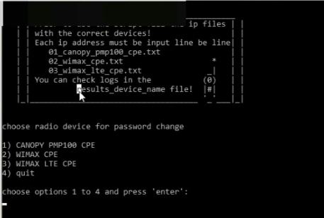

######  <h2> Web UI Automation for password changes
 
This console-based script helped to automate quarter-yearly compliance task for password changes on hundreds of CPE radio antennas. 

######  <h2> Dependencies

* Python 3
* Selenium Webdriver

######  <h2> Usage

<h3><a href="https://arturfatkul.github.io/webautomation-4radio-antennas/">video demonstration</a></h3>

