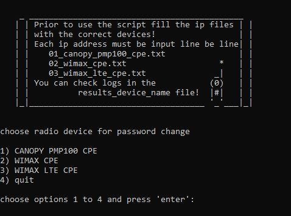

######  <h2> Web UI Automation for password changes
 
This console-based script helped to automate quarter-yearly compliance task for password change on hundreds of radio antennas. Option for password change through the SNMP was missing, that's why web automation was the only choice.

######  <h2> Dependencies

Python3, Selenium Webdriver

<h4><a href="https://arturfatkul.github.io/webautomation-4radio-antennas/">Сlick on this link to watch the video</a></h4>

